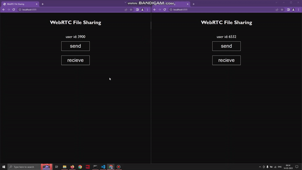

# WebRTC-File-Sharing

A simple experiment with WebRTC by using it to transfer files, peer to peer with the help of a custom WebSocket server to do signalling between the peers. Chrome-to-Chrome, Firefox-to-Firefox and also cross-browser transfers tested. 

You can locally host the website and use it to share files between your devices (Devices need to be on the same Wi-Fi network as the server).

To access the site from another device, which is not your server, find out your IP Address and use that to access the site. Also in the __index.js__ file, change the WebSocket connection url with your IP Address, like so.
```javascript
const ws = new WebSocket(`ws://${IP_ADDRESS}:8895`);
```
## Demo



## Dependencies

- websocket
```
npm i websocket
```
